# 🤖 Intelligent Tech Support Agent (RAG) 


An AI-powered Technical Support Assistant architected as a **Microservices Application**. It uses **RAG (Retrieval-Augmented Generation)** to answer questions based on any uploaded PDF manual.

## 🏗 Architecture

```mermaid
graph LR
    classDef user fill:#f9f,stroke:#333,stroke-width:2px,color:#000;
    classDef app fill:#bbdefb,stroke:#1565c0,stroke-width:2px,color:#000;
    classDef db fill:#fff9c4,stroke:#fbc02d,stroke-width:2px,color:#000;
    classDef cloud fill:#f3e5f5,stroke:#7b1fa2,stroke-width:2px,color:#000;


    User["👤 User / Browser"]:::user

    subgraph Docker_Network ["🐳 Docker Compose Network"]
        direction TB
        Frontend["🖥️ Frontend Service<br/>(Streamlit)"]:::app
        Backend["⚙️ Backend API<br/>(FastAPI)"]:::app
        
        subgraph Persistence
            Chroma[("🗄️ ChromaDB<br/>Vector Store")]:::db
            Volume[("💾 Docker Volume")]:::db
        end
    end

    External_LLM(("☁️ Groq API<br/>Llama 3.3")):::cloud

    User <-->|1. Upload & Chat| Frontend
    Frontend <-->|2. HTTP Request| Backend
    Backend <-->|3. Embeddings| Chroma
    Chroma <-->|4. Persist Data| Volume
    Backend <-->|5. Inference| External_LLM
```


The system is decoupled into two containers orchestrated by Docker Compose:

1.  **Backend Service (`api.py`):**
    * **Framework:** FastAPI (High-performance Async API).
    * **Responsibility:** Handles PDF ingestion, Chunking, Embedding Generation (ChromaDB), and LLM Inference (Llama 3.3 via Groq).
    * **Endpoints:** `/ingest` (Upload) and `/chat` (Q&A).

2.  **Frontend Service (`ui.py`):**
    * **Framework:** Streamlit.
    * **Responsibility:** User Interface.
    * **Communication:** Sends HTTP requests to the Backend API via the internal Docker network (`http://backend:8000`).
  

## 📂 Codebase Structure

The core logic is modularized to ensure separation of concerns:

### 1. The ETL Pipeline (`src/ingestion.py`)
Responsible for processing raw data into machine-understandable vectors.
* **Extract:** Loads PDF documents using `PyPDFLoader`.
* **Transform:** Splits text into semantic chunks (500 chars) using `RecursiveCharacterTextSplitter`.
* **Load:** Generates embeddings (via HuggingFace) and saves them into the **ChromaDB** vector store.

### 2. The RAG Engine (`src/app.py`)
The brain of the retrieval system.
* **Retrieval:** Performs semantic search on ChromaDB to find the top-3 most relevant document chunks for a user query.
* **Generation:** Constructs a context-rich prompt and queries the **Llama 3.3** model via Groq.

### 3. The API Gateway (`src/api.py`)
* Acts as the entry point for the backend container.
* Exposes REST endpoints (`/ingest`, `/chat`) and handles HTTP request/response lifecycles.

### 4. The Frontend (`src/ui.py`)
* A pure Python interface using Streamlit.
* Completely decoupled from logic; it only communicates with the backend via API calls.

## 🛠 Tech Stack

* **Orchestration:** Docker Compose
* **LLM:** Llama 3.3-70b-versatile (Groq API)
* **Vector DB:** ChromaDB (Persistent Volume)
* **CI/CD:** GitHub Actions (Automated Build Pipeline) 
* **Embeddings:** HuggingFace `paraphrase-multilingual`
* **Language:** Python 3.11

## 🚀 How to Run (The Magic Command)

### Prerequisites
* Docker & Docker Compose installed.
* A Groq API Key.

### Steps

1.  **Clone and Configure:**
    Create a `.env` file in the root directory:
    ```env
    GROQ_API_KEY=your_key_here
    ```

2.  **Launch the Stack:**
    This command builds both images and establishes the internal network.
    ```bash
    docker-compose up --build
    ```

3.  **Access the App:**
    * **Frontend:** Open `http://localhost:8501` to chat.
    * **API Docs:** Open `http://localhost:8000/docs` to test endpoints directly.

